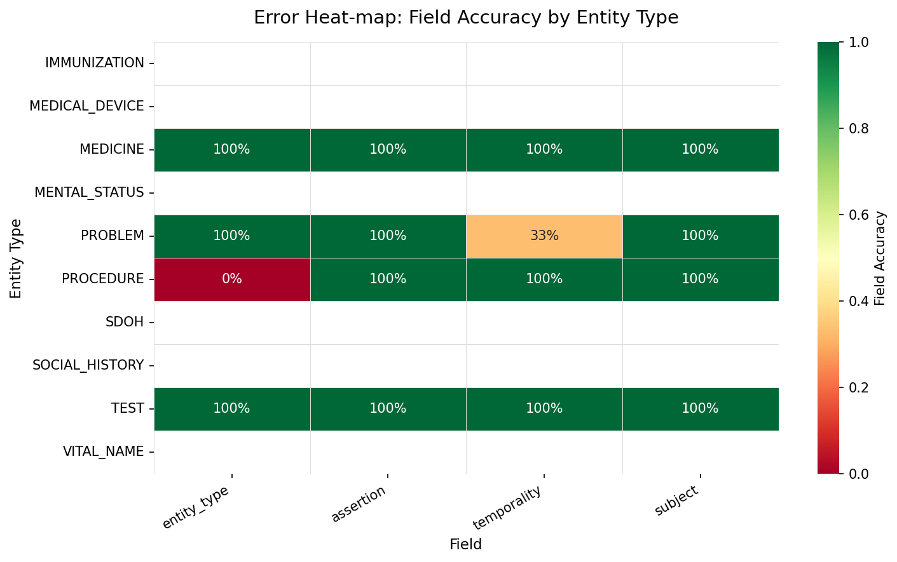

# 📊 HiLabs Workshop — Evaluation Report

> Generated: 2026-03-14 13:10  
> Pipeline: OCR → Clinical NLP → Entity Extraction

---

## 0. Problem Understanding & Pipeline

This system evaluates a healthcare AI extraction pipeline and its reliability layer.

**Workflow:**
1. Medical PDF document
2. OCR conversion
3. Text normalization
4. Clinical NLP entity extraction
5. Structured JSON output

The evaluator compares extracted structured entities against reference labels and reports quantitative + qualitative failure modes.

## 1. Quantitative Evaluation Summary

| Metric | Value |
|---|---|
| Documents evaluated | 1 |
| Ground truth entities | 7 |
| Predicted entities | 12 |
| Matched (≥80% similarity) | 7 |
| False Negatives (missed) | 0 |
| False Positives (hallucinated) | 5 |
| **Entity Precision** | **58.3%** |
| **Entity Recall** | **100.0%** |
| **Entity F1** | **73.7%** |

### Field-Level Accuracy (on matched entities)

- **entity_type**: 🟢 █████████████████    85.7%
- **assertion**: 🟢 ████████████████████ 100.0%
- **temporality**: 🟡 ██████████████       71.4%
- **subject**: 🟢 ████████████████████ 100.0%

---

## 2. Error Heat-map

Rows = entity types, Columns = categorical fields. Cell = accuracy.

## 2B. Input vs Output Analysis (Examples)

The table below compares source text snippets with AI-generated structured output and expected correction.

| Document | Source Text | AI Output | Error Type | Explanation | Correct Output |
|---|---|---|---|---|---|
| patient_001 | Patient presents with chest pain and shortness of breath. | {'entity': 'chest pain', 'entity_type': 'PROBLEM', 'assertion': 'POSITIVE', 'temporality': 'CURRENT', 'subject': 'PATIENT'} | Hallucination | Predicted entity has no matched ground-truth entity. | Remove this entity from output. |
| patient_001 | Patient presents with chest pain and shortness of breath. | {'entity': 'shortness of breath', 'entity_type': 'PROBLEM', 'assertion': 'POSITIVE', 'temporality': 'CURRENT', 'subject': 'PATIENT'} | Hallucination | Predicted entity has no matched ground-truth entity. | Remove this entity from output. |
| patient_001 | Blood Pressure: 140/90 mmHg | {'entity': 'Blood Pressure', 'entity_type': 'VITAL_NAME', 'assertion': 'POSITIVE', 'temporality': 'CURRENT', 'subject': 'PATIENT'} | Hallucination | Predicted entity has no matched ground-truth entity. | Remove this entity from output. |
| patient_001 | Heart Rate: 78 bpm | {'entity': 'Heart Rate', 'entity_type': 'VITAL_NAME', 'assertion': 'POSITIVE', 'temporality': 'CURRENT', 'subject': 'PATIENT'} | Hallucination | Predicted entity has no matched ground-truth entity. | Remove this entity from output. |
| patient_001 | HbA1c: 7.2% | {'entity': 'HbA1c', 'entity_type': 'TEST', 'assertion': 'POSITIVE', 'temporality': 'CURRENT', 'subject': 'PATIENT'} | Hallucination | Predicted entity has no matched ground-truth entity. | Remove this entity from output. |

---

## 3. Entity Type Recall

| Entity Type | Recall |
|---|---|
| IMMUNIZATION | N/A |
| MEDICAL_DEVICE | N/A |
| MENTAL_STATUS | N/A |
| SDOH | N/A |
| SOCIAL_HISTORY | N/A |
| VITAL_NAME | N/A |
| MEDICINE | 100.0% |
| PROBLEM | 100.0% |
| PROCEDURE | 100.0% |
| TEST | 100.0% |

---

## 4. Metadata Field Scores

| Field | Correct | Wrong | Missing | Accuracy |
|---|---|---|---|---|
| `STRENGTH` | 0 | 0 | 0 | N/A |
| `UNIT` | 0 | 0 | 0 | N/A |
| `DOSE` | 0 | 0 | 0 | N/A |
| `ROUTE` | 0 | 0 | 0 | N/A |
| `FREQUENCY` | 0 | 0 | 0 | N/A |
| `FORM` | 0 | 0 | 0 | N/A |
| `DURATION` | 0 | 0 | 0 | N/A |
| `STATUS` | 0 | 0 | 0 | N/A |
| `exact_date` | 0 | 0 | 0 | N/A |
| `derived_date` | 0 | 0 | 0 | N/A |
| `TEST_VALUE` | 0 | 0 | 0 | N/A |
| `TEST_UNIT` | 0 | 0 | 0 | N/A |
| `VITAL_NAME_UNIT` | 0 | 0 | 0 | N/A |
| `VITAL_NAME_VALUE` | 0 | 0 | 0 | N/A |

---

## 5. Top Systemic Weaknesses

### 5.1 Entity Detection
- **False Negative rate**: 0.0% — the pipeline *misses* 0 ground-truth entities.
- **False Positive rate**: 41.7% — the pipeline *hallucinates* 5 entities not in the text.

## 5B. Error Classification

Errors are categorized into extraction misses, hallucinations, and field-level misclassifications across:
- Entity extraction
- Temporality
- Subject attribution
- Negation/assertion

Each qualitative row is recorded with: source text, AI output, error type, explanation, and corrected output.

### 5.2 Worst-Performing Fields
- `temporality` accuracy: **71.4%** — high misclassification rate.
- `entity_type` accuracy: **85.7%** — high misclassification rate.
- `assertion` accuracy: **100.0%** — high misclassification rate.

### 5.3 Lowest-Recall Entity Types
- `MEDICINE`: recall **100.0%** — frequently missed by the LLM.
- `PROBLEM`: recall **100.0%** — frequently missed by the LLM.
- `PROCEDURE`: recall **100.0%** — frequently missed by the LLM.

---

## 6. Proposed Guardrails for Reliability

### 6.1 Confidence Scoring
- Attach a confidence score (0–1) to each extracted entity.
- Flag entities below threshold (e.g., < 0.7) for human review.
- Especially important for `entity_type` and `assertion` fields.

### 6.2 Schema Validation
- Validate every LLM output against the JSON schema before saving.
- Reject any entity with missing required fields or invalid enum values.
- Auto-correct obvious normalisation issues (e.g. lowercase → UPPERCASE enums).

### 6.3 Rule-Based Post-Processing
- Apply medication-specific rules: if `entity_type == MEDICINE`,
  require at least one of `DOSE`, `ROUTE`, or `FREQUENCY` in metadata.
- Cross-reference extracted dates against document date context.
- Flag `FAMILY_MEMBER` subject entities for secondary review.

### 6.4 Ensemble / Voting
- Run two LLMs and take the intersection as high-confidence output.
- Entities only in one model's output are flagged as uncertain.

### 6.5 Hallucination Detection
- After extraction, verify each entity string appears (approximately) in the source text.
- If fuzzy match score to source < 60%, flag as potential hallucination.

### 6.6 Section-Aware Extraction
- Pre-segment documents by heading before LLM extraction.
- This constrains the `heading` field and reduces cross-section confusion.

### 6.7 Implemented Reliability Checks (Run-Time)
| Check | Flagged | Passed | Flag Rate |
|---|---|---|---|
| source_consistency_check | 5 | 7 | 41.7% |
| hallucination_detection | 0 | 12 | 0.0% |
| negation_validation | 0 | 12 | 0.0% |
| temporal_validation | 0 | 12 | 0.0% |
| subject_attribution_validation | 0 | 12 | 0.0% |

### 6.8 Reliability Check Examples
- No reliability flags triggered in this run.

---

## 7. Per-Document Summary

| Document | GT | Pred | Matched | FN | FP | Recall | Precision |
|---|---|---|---|---|---|---|---|
| patient_001 | 7 | 12 | 7 | 0 | 5 | 100.0% | 58.3% |

---

*Report auto-generated by `run_pipeline.py`*
